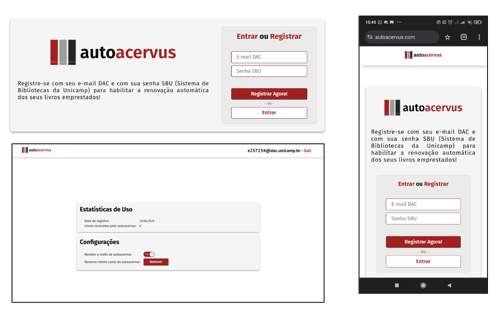

<!-- PROJECT LOGO -->
 

  

  <h3 align="center">AutoAcervus</h3>

  

    Serviço web para renovação automático de empréstimo de livros no Sistema de Bibliotecas da Unicamp (SBU)
     
    (Projeto final da disciplina MC322 - Programação Orientada a Objetos)
     
     
    <a href="https://docs.google.com/document/d/1WHx2hEnbyBYFC4CyMHMCtGe-4rY9JDdWDebK5mrI0zE/edit?usp=sharing">Relatório do projeto</a>
    ·
    <a href="https://docs.google.com/presentation/d/17AEzoS3YiGCiDXaCo9Z7VaEceQDwxCuV7FqR3COiW0o/edit#slide=id.g2e7beecba21_2_16">Slides de apresentação</a>
  

<!-- ABOUT THE PROJECT -->
## Sobre o Projeto

    

Para renovar o empréstimo de um livro de uma das bibliotecas da Unicamp, os estudantes devem acessar o site “https://acervus.unicamp.br/”, entrar com sua conta SBU (Sistema de Bibliotecas Unicamp), selecionar os livros a serem renovados e clicar no botão “renovar empréstimos”.  No máximo, os livros podem ser emprestados por uma semana antes de precisarem ser renovados, o que significa que esse processo de renovação deve ser feito pelo menos uma vez por semana a fim de manter a posse dos livros por maior tempo. Dada a natureza mecânica do processo e a frequência com a qual deve ser feito, apresenta-se a ideia de criar um sistema que automaticamente o faz, tudo em segundo plano, sem que o usuário deva se preocupar com a tarefa.

A relativa facilidade em automatizar o sistema Acervus e a grande utilidade do projeto (em teoria, todos que emprestam livros das bibliotecas se beneficiariam em utilizá-lo) justificam o desenvolvimento do projeto, ao qual deu-se o nome de autoacervus.

<ul>
    <li> Link da plataforma: https://autoacervus.com/ (em funcionamento pelo menos até o fim de jun/2024). </li>
</ul>

(<a href="#readme-top">back to top</a>)

### Feito com

* 
* 
* 
* 
* 

(<a href="#readme-top">back to top</a>)

## Execução

### Instruções para Deploy

1. Assine um serviço de hospedagem (ou tenha uma máquina Linux ociosa)
2. Tenha um domínio configurado para apontar para o IP da máquina que hospedará o autoacervus
3. Instale Docker e Docker Compose
4. Clone o repositório
5. Altere `.env`
6. Copie `src/main/resources/application.properties.example` para `src/main/resources/application.properties` e edite de acordo. Também altere o item `command` do serviço `certbot` em `docker-compose.yml`
7. Edite `nginx/autoacervus.conf` e `nginx/autoacervus.after.conf` de acordo
8. Execute `docker compose up -d --build mysql java nginx`
9. Execute `docker compose up -d certbot`
10. Execute `crontab -e` e adicione uma nova entrada: `0 0 1 */2 * docker start autoacervus-certbot; docker restart autoacervus-nginx`
11. Execute `mv nginx/autoacervus.after.conf nginx/autoacervus.conf`
12. Reinicie o contêiner do nginx com `docker compose restart nginx`

### Instruções para Self Host sem Deploy

1. Repita os passos 3, 4, 5 e 6 das instruções de Deploy
2. Execute `docker compose up -d --build mysql java`

### Instruções para Execução do Projeto em uma IDE
1. Clone o repositório
2. Copie `src/main/resources/application.properties.example` para `src/main/resources/application.properties` e edite de acordo.
3. Instale MySQL Server e crie um novo usuário, cujas credenciais deverão estar especificadas em `application.properties`.
4. Execute a script de criação do banco de dados, `src/main/sql/autoacervus-db-creation_script.sql`
5. Especifique uma varíável de ambiente com nome `AES256_SECRET_KEY` de 32 caracteres, ou pule esse passo para usar uma chave padrão (não seguro).
5. Execute `AutoacervusApplication.java`